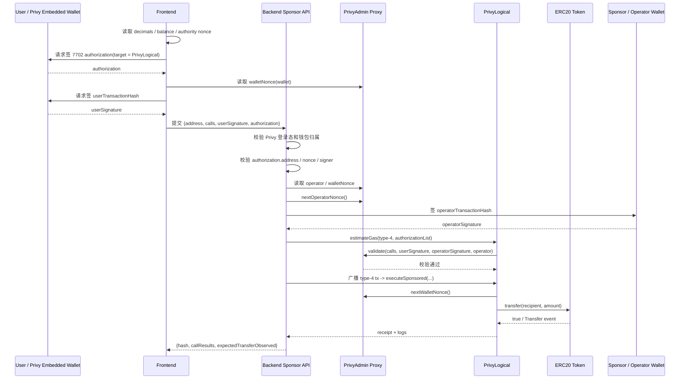

# Privy 7702 + Backend Sponsor 流程

本文档描述 `privy-next-wagmi-gas-sponsor` 当前保留的唯一主流程：

- 前端用 Privy 完成 `EIP-7702 authorization`
- 前端用 Privy 完成用户签名
- 后端 sponsor/operator 补签并广播 type-4 交易
- 目标动作固定为 `ERC-20 transfer`

## 1. 入口文件

- 页面：`src/app/page.tsx`
- 交互组件：`src/components/sections/privy-erc20-transfer-7702.tsx`
- 后端接口：`src/app/api/privy-erc20-transfer-7702/route.ts`
- 前端工具：`src/lib/privy-gas-sponsorship.ts`
- 后端工具：`src/lib/privy-gas-sponsorship-server.ts`
- 执行合约：`contracts/src/PrivyLogical.sol`
- 校验合约：`contracts/src/PrivyAdmin.sol`

## 2. 关键地址关系

- `PrivyAdmin proxy`：保存 wallet nonce / operator nonce / operator 白名单
- `PrivyLogical`：真正执行 `executeSponsored(...)`
- `authorization.address`：必须等于最终部署出来的真实 `PrivyLogical` 地址

注意：

- 不能填 CREATE3 中间壳地址
- 必须填 CREATE3 最终落地后的逻辑合约地址

## 3. 流程图



## 4. 前端步骤

1. 登录 Privy
2. 选择 sender wallet
3. 输入 token / recipient / amount
4. 自动读取：
   - `decimals()`
   - `balanceOf(sender)`
   - authority 当前链上 nonce
5. 点击 `Sign with Privy`
6. 点击 `Submit Sponsored Transfer`

## 5. 后端步骤

后端收到请求后按下面顺序处理：

1. 校验 Privy access token
2. 校验选中钱包属于当前用户
3. 校验 `authorization.address == deployed PrivyLogical`
4. 校验 `authorization.chainId == 97`
5. 校验 authority 当前 nonce 与 `authorization.nonce` 一致
6. 校验 authority 当前 code 状态是否允许 7702 delegation
7. 校验 `recoverAuthorizationAddress(...) == user wallet`
8. 校验 `verifyMessage(userTransactionHash, userSignature)`
9. 校验 sponsor 是否已注册 operator
10. 调 `nextOperatorNonce()`
11. 生成 `operatorSignature`
12. `estimateGas` 预检通过后广播
13. 等待 receipt 并检查 Transfer 日志

## 6. 哈希口径

### User signature

```text
keccak256(abi.encodePacked(
  wallet,
  abi.encode(calls),
  walletNonce,
  chainId,
  adminProxy
))
```

### Operator signature

```text
keccak256(abi.encodePacked(
  wallet,
  abi.encode(calls),
  operatorNonce,
  chainId,
  adminProxy,
  "SPONSOR"
))
```

## 7. 关键约束

### 7.1 authorization 必须 fresh

- `authorization.nonce` 必须等于 authority 当前 nonce
- 一旦 nonce 前进，旧 authorization 就会失效
- 所以必须重新签并尽快提交

### 7.2 target 必须是真实 logical 地址

如果填错成 CREATE3 壳地址，就会出现：

- `authorization.address must match the deployed PrivyLogical address`

### 7.3 logical 的 admin 必须绑定 proxy

`PrivyLogical.PRIVY_ADMIN` 必须等于 `PrivyAdmin proxy`，不能指到 implementation。

## 8. 成功判定

一次 sponsor 转账成功，建议同时满足：

- `receiptStatus == success`
- `failedCallCount == 0`
- `callResults[0].success == true`
- `expectedTransferObserved == true`

## 9. 关于 explorer 里的 Validity=False

如果交易已经成功消费了这条 authorization，authority nonce 会递增。

这时 explorer 再看这条旧 authorization，会显示 `Validity=False`。这是正常的防重放结果，不表示刚刚那笔成功交易是失败的。
